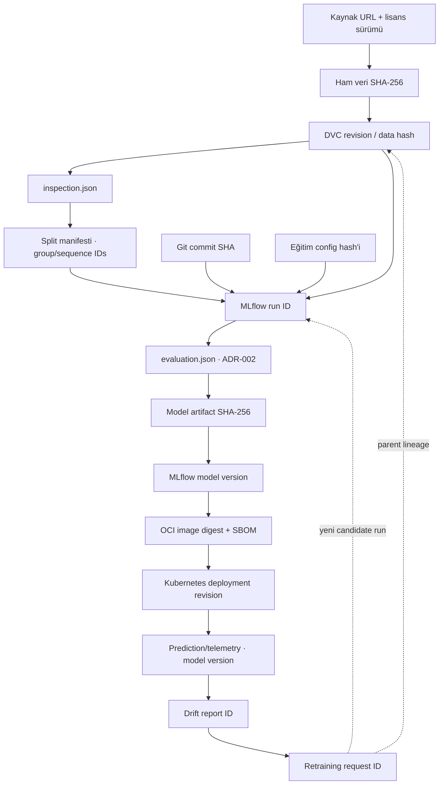

# RadarIQops ML yaşam döngüsü, güven sınırları ve soy ağacı

- Durum: Hedef mimari
- Tarih: 9 Ağustos 2026
- Kapsam: `modulation_classification` araştırma prototipinden kontrollü model servisine kadar olan yaşam döngüsü
- İlgili kararlar: [ADR-001 görev tanımı](../adr/ADR-001-task-definition.md), [ADR-002 model değerlendirmesi](../adr/ADR-002-model-evaluation.md)

## Amaç

Bu belge veri alımından yeniden eğitime kadar olan zinciri, güven sınırlarını ve kod/veri/model soy ağacını tanımlar. Hedef, üretimde çalışan her model sürümünün hangi kod, veri, yapılandırma ve değerlendirme sonucundan üretildiğini geriye doğru kanıtlayabilmektir.

Bu mimari DVC, MLflow, container registry veya Kubernetes'in kurulduğu anlamına gelmez. Uygulama görevlerinin uyması gereken sözleşmeyi ve kontrol kapılarını tanımlar.

## Uçtan uca zincir

```mermaid
flowchart LR
    subgraph TB0["TB-0 · Harici ve güvenilmeyen kaynaklar"]
        PROVIDER["Veri sağlayıcısı"]
        CLIENT["API istemcisi"]
    end

    subgraph TB1["TB-1 · Veri kabul ve sürümleme alanı"]
        INSPECT["radariq data inspect"]
        MANIFEST["Lisans + checksum + inspection manifesti"]
        DVC["DVC veri sürümü"]
        DVCREMOTE[("DVC remote / nesne deposu")]
    end

    subgraph TB2["TB-2 · CI ve eğitim alanı"]
        TRAIN["Eğitim pipeline'ı"]
        EVAL["ADR-002 değerlendirmesi"]
        MLFLOW["MLflow run + artifact kaydı"]
        MODELREG["Model registry · candidate"]
    end

    subgraph TB3["TB-3 · Yazılım tedarik zinciri"]
        APIBUILD["API + model paketi"]
        IMAGE["OCI image + SBOM + imza"]
        REGISTRY[("Container registry")]
    end

    subgraph TB4["TB-4 · Kubernetes üretim alanı"]
        INGRESS["Ingress / kimlik doğrulama / rate limit"]
        API["Inference API"]
        DEPLOY["Kubernetes Deployment"]
        TELEMETRY["Metrik + log + trace"]
    end

    subgraph TB5["TB-5 · İzleme ve model yönetişimi"]
        MONITOR["Operasyon + kalite monitoring"]
        DRIFT["Drift değerlendirmesi"]
        ALERT["Alarm + inceleme kaydı"]
        RETRAIN["Onaylı retraining isteği"]
        PROMOTE{"İnsan onaylı promotion kapısı"}
    end

    PROVIDER -->|"TLS · lisans allowlist · checksum"| INSPECT
    INSPECT --> MANIFEST --> DVC --> DVCREMOTE
    DVCREMOTE -->|"workload identity · salt-okunur veri"| TRAIN
    TRAIN --> EVAL --> MLFLOW --> MODELREG
    MODELREG -->|"onaylı model digest'i"| APIBUILD
    APIBUILD --> IMAGE --> REGISTRY
    REGISTRY -->|"imza + digest doğrulama"| DEPLOY
    DEPLOY --> API
    CLIENT -->|"TLS · auth · kota"| INGRESS --> API
    API --> TELEMETRY
    TELEMETRY -->|"minimize edilmiş telemetry"| MONITOR --> DRIFT --> ALERT
    ALERT -->|"otomatik deploy yok"| RETRAIN --> TRAIN
    MODELREG --> PROMOTE -->|"değişmez sürüm seçimi"| APIBUILD
```



Ana güvenlik kuralı: drift veya retraining sonucu hiçbir model otomatik olarak production'a terfi ettirilemez. Otomasyon yalnızca yeni bir `candidate` model ve değerlendirme raporu üretebilir; production promotion insan onayı gerektirir.

## Aşama sözleşmesi

| Aşama | Girdi | Zorunlu çıktı | Birincil sahip | Geçiş koşulu |
|---|---|---|---|---|
| Veri kabul | Harici veri dosyaları | Lisans kaydı, SHA-256, `inspection.json` | Veri sorumlusu | Kaynak/lisans onaylı; shape, dtype ve etiket semantiği doğrulanmış |
| DVC sürümleme | Kabul edilmiş veri | DVC hash/revision ve immutable remote nesnesi | Veri sorumlusu | Hash eşleşiyor; çalışma alanında ham veri Git'e eklenmemiş |
| Eğitim | DVC revision, Git SHA, config | Checkpoint, eğitim logu, split manifesti | ML sorumlusu | Grup/sequence sızıntısı yok; çalışma tekrarlanabilir |
| Değerlendirme | Candidate model, sabit test split | ADR-002 uyumlu `evaluation.json` | Model sahibi | Önceden tanımlanmış kabul eşikleri sağlanmış |
| MLflow kayıt | Eğitim ve değerlendirme artifact'ları | Run ID, artifact hash, candidate model version | Model sahibi | Zorunlu lineage alanlarının tamamı dolu |
| API paketleme | Onaylanmış model version | Sürüm sabitlenmiş API paketi | API sahibi | Model digest'i ve çıktı şeması doğrulanmış |
| Container | API paketi | OCI digest, SBOM, tarama sonucu ve imza | Platform/Security | Kritik açık yok; image imzası geçerli |
| Kubernetes | İmzalı OCI image | Deployment revision ve rollout kaydı | Platform/SRE | Staging smoke testi, kaynak limitleri ve rollback hazır |
| Monitoring | Üretim metrik/log/trace | Dashboard, alarm ve sürümlü drift raporu | SRE + model sahibi | Telemetry model version taşır; hassas ham veri loglanmaz |
| Drift | Referans + güncel pencere | Drift kararı, kanıt ve inceleme bileti | Model sahibi | Manifestteki eşik aşılmış ve veri kalitesi kontrol edilmiş |
| Retraining | Onaylı bilet, yeni DVC revision | Yeni MLflow run ve candidate model | ML sorumlusu | Normal eğitim/değerlendirme/promotion kapıları yeniden geçilmiş |

## Güven sınırları

Güven sınırı, veri veya yetkinin farklı kimlik, ağ, depolama ya da sorumluluk alanına geçtiği noktadır.

| Sınır | Geçen varlık | Başlıca tehdit | Zorunlu kontroller |
|---|---|---|---|
| `TB-0 → TB-1` | Veri dosyası ve metadata | Lisanssız, bozuk veya zehirlenmiş veri | Kaynak allowlist, lisans kaydı, SHA-256, şema inceleme, pickle için açık güven onayı |
| `TB-1 → TB-2` | DVC revision | Eğitim verisinin sessizce değişmesi | Immutable hash, salt-okunur mount, en az yetkili workload identity |
| `TB-2 → TB-3` | Model artifact | Yanlış veya değiştirilmiş modelin paketlenmesi | MLflow model version + artifact digest + promotion onayı |
| `TB-3 → TB-4` | OCI image | Tedarik zinciri saldırısı veya eski image | Digest pinning, SBOM, zafiyet taraması, imza doğrulama |
| `TB-0 → TB-4` | API isteği | Yetkisiz kullanım, kötü amaçlı payload, kaynak tüketimi | TLS, auth, boyut/şema limiti, rate limit, timeout |
| `TB-4 → TB-5` | Telemetry | Ham sinyal veya gizli verinin loglara sızması | Veri minimizasyonu, redaction, erişim kontrolü, saklama süresi |
| `TB-5 → TB-2` | Retraining isteği ve yeni veri revision | Drift alarmıyla kontrolsüz model değişimi | İnsan onaylı bilet, sabit DVC revision, normal CI ve değerlendirme kapıları |

## Kod, veri ve model soy ağacı



### Zorunlu lineage alanları

| Varlık | Zorunlu kimlikler |
|---|---|
| Veri seti | `dataset_name`, `dataset_version`, `source_url`, `license_id`, `raw_sha256`, `dvc_revision` |
| İnceleme | `inspection_schema_version`, `inspection_sha256`, `shape`, `dtype`, `class_map_sha256` |
| Bölme | `split_manifest_sha256`, `split_seed`, `group_key`, `sequence_key`, sınıf/SNR dağılımı |
| Kod ve config | `git_commit_sha`, dirty-worktree bayrağı, `training_config_sha256`, runtime/dependency lock hash'i |
| Eğitim | `mlflow_run_id`, parent run, seed, donanım, başlangıç/bitiş zamanı |
| Değerlendirme | `evaluation_sha256`, Macro-F1, sınıf recall, SNR dilimleri, ECE, model boyutu, p95, hata oranı |
| Model | `model_artifact_sha256`, `model_version`, framework, precision ve çıktı şeması sürümü |
| Container | `image_digest`, `sbom_digest`, imza kimliği ve güvenlik tarama raporu |
| Deployment | cluster/environment, namespace, deployment revision, image digest, model version ve rollout zamanı |
| Telemetry | event zamanı, anonim istek kimliği, deployment revision, model version ve sonuç durumu |
| Drift/retraining | referans pencere, güncel pencere, drift rapor ID, karar, onaylayan ve parent model/run ID |

Bir production deployment kaydı; `image_digest → model_version → model_artifact_sha256 → mlflow_run_id → git_commit_sha + dvc_revision + training_config_sha256` zincirini eksiksiz çözebilmelidir.

## Promotion kapıları

```text
G0 Veri kabulü
  → G1 Eğitim tamamlandı
  → G2 ADR-002 değerlendirmesi geçti
  → G3 Model registry candidate kaydı
  → G4 Container tarama + imza geçti
  → G5 Staging smoke/canary geçti
  → G6 İnsan production onayı
  → G7 Production rollout + doğrulanmış rollback noktası
```

Bir kapının kanıtı yoksa sonraki aşamaya geçilemez. Aynı kişinin veri kabulü, model promotion ve production deployment adımlarının tamamında tek başına onay vermemesi tercih edilir. Ekip tek kişiyse bu durum risk kaydında görünür tutulur ve GitHub/MLflow/Kubernetes audit kayıtları korunur.

## Monitoring ve drift sözleşmesi

Monitoring dört ayrı sinyal ailesini izler:

- **Operasyon:** istek sayısı, hata oranı, timeout, p50/p95/p99 gecikme, pod restart ve kaynak doygunluğu.
- **Girdi kalitesi:** shape/dtype reddi, NaN/Infinity, eksik SNR ve beklenmeyen değer aralığı.
- **Dağılım drift'i:** eğitim referansına göre özellik, SNR, tahmin sınıfı ve güven dağılımı değişimi.
- **Performans drift'i:** gecikmeli gerçek etiket varsa Macro-F1, sınıf recall ve kalibrasyon değişimi.

Drift eşiği veri ve model sürümüne bağlı bir monitoring manifestinde tanımlanır. Eşik aşımı otomatik retraining başlatmaz; alarm, veri kalitesi kontrolü ve model sahibi onayından sonra retraining bileti oluşturur.

Retraining sonucunda mevcut production model değiştirilmez. Yeni run önce ADR-002 değerlendirmesini, güvenlik taramasını, staging testini ve insan promotion kapısını yeniden geçer.

## Risk kaydı

“Sahip”, riski tek başına çözen kişi değil; kontrolün işletildiğini ve ölçütün raporlandığını takip eden roldür.

| ID | Risk | Risk sahibi | Azaltma kontrolü | Ölçülebilir azaltma ölçütü |
|---|---|---|---|---|
| `R-01` | Lisanssız veya kaynağı belirsiz veri kullanımı | Veri sorumlusu | Lisans ve kaynak manifesti olmadan DVC kabulü yok | Kabul edilen veri dosyalarında manifest kapsamı `%100`; lisanssız dosya `0` |
| `R-02` | Bozuk/zehirlenmiş verinin eğitime girmesi | Veri sorumlusu + Security | Allowlist, SHA-256 ve `data inspect` şema kontrolü | Checksum uyuşmazlığıyla eğitime geçen dosya `0`; inspection kapsamı `%100` |
| `R-03` | Train/test veri sızıntısı | ML sorumlusu | `group_id`/`sequence_id` tabanlı split doğrulaması | Bölmeler arası grup/sequence kesişimi `0` |
| `R-04` | Deneyin yeniden üretilememesi | ML sorumlusu | Git, DVC, config, seed ve environment kimliklerini MLflow'a bağlama | Zorunlu lineage alanı doluluk oranı `%100` |
| `R-05` | Değerlendirilmemiş modelin kayda alınması | Model sahibi | ADR-002 raporu ve registry candidate kapısı | `evaluation.json` olmadan kaydedilen candidate/production model `0` |
| `R-06` | Model veya container artifact'ının değiştirilmesi | Platform + Security | Artifact hash, image digest, SBOM ve imza doğrulama | İmzasız image ile production rollout `0`; doğrulama başarısı `%100` |
| `R-07` | Kritik zafiyetli container'ın yayınlanması | Security | Build sırasında image taraması ve promotion engeli | Açık kritik zafiyetle production'a çıkan image `0` |
| `R-08` | Yetkisiz veya kaynak tüketen API kullanımı | API sahibi + Security | Auth, rate limit, body limiti ve timeout | Korunan endpoint'te yetkisiz başarılı istek `0`; limit uygulanan endpoint oranı `%100` |
| `R-09` | Secret'ın image, Git veya log içine girmesi | Platform + Security | Kubernetes Secret/external secret, secret scan ve log redaction | Düz metin secret bulgusu `0`; taranan release oranı `%100` |
| `R-10` | Telemetry içinde ham I/Q veya hassas veri sızıntısı | SRE + veri sorumlusu | Allowlist tabanlı telemetry şeması ve saklama politikası | Ham I/Q payload içeren production log olayı `0` |
| `R-11` | Drift'in izlenmemesi veya yanlış modelle ilişkilendirilmesi | Model sahibi + SRE | Her event'te model/deployment sürümü ve zamanlanmış drift işi | Sürüm kimliği eksik inference telemetry olayı `0`; drift işi başarı oranı `>= %99` |
| `R-12` | Drift alarmının kontrolsüz retraining/deploy başlatması | Model sahibi + ürün sahibi | İnsan onaylı retraining bileti ve ayrı production promotion | Onaysız retraining production promotion sayısı `0`; onay kaydı kapsamı `%100` |
| `R-13` | Hatalı rollout'tan geri dönülememesi | Platform/SRE | Değişmez image/model sürümü ve test edilen rollback runbook'u | Release öncesi rollback noktası kapsamı `%100`; rollback tatbikatı başarı oranı `%100` |
| `R-14` | Monitoring'in servis bozulmasını geç fark etmesi | SRE | Hata, p95 ve pod sağlık alarmları | Production deployment'larında zorunlu alarm kapsamı `%100`; alarm test başarısı `%100` |

## Sahiplik ve ayrım

| Rol | Asgari sorumluluk |
|---|---|
| Veri sorumlusu | Kaynak, lisans, checksum, DVC revision ve veri kabul kaydı |
| ML sorumlusu | Split, eğitim config'i, tekrar üretilebilirlik ve retraining run'ı |
| Model sahibi | ADR-002 değerlendirmesi, drift yorumu ve model risk kararı |
| API sahibi | İstek/yanıt şeması, auth, rate limit ve çıkarım hata davranışı |
| Platform/SRE | Container, registry, Kubernetes, rollout, monitoring ve rollback |
| Security | Secret, artifact imzası, zafiyet taraması ve güven sınırı kontrolleri |
| Ürün sahibi | Kullanım sınırı, kabul eşiği ve production promotion iş kararı |

İsimler henüz atanmadıysa roller yine boş bırakılamaz; proje risk kaydında “atanmamış rol” olarak görünür ve production promotion engellenir.

## Uygulama sırası

1. DVC veri manifesti ve remote erişim politikası.
2. Tek komutla eğitim ve ADR-002 JSON değerlendirme raporu.
3. MLflow tracking/registry ve zorunlu lineage etiketleri.
4. Sürüm sabitlenmiş inference API.
5. Tekrarlanabilir OCI build, SBOM, tarama ve imza.
6. Kubernetes staging deployment, health probe, kaynak limiti ve rollback.
7. Operasyon telemetry'si ve model sürümü ilişkilendirmesi.
8. Drift manifesti, alarm ve insan onaylı retraining akışı.

Bu sıra değiştirilirse atlanan kontrol kapısı ve risk sahibi ayrıca kaydedilmelidir.

